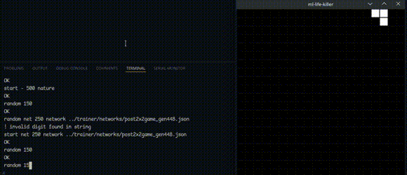

-00ABFA?style=flat)

# ml-life-killer

Homemade tooling for training and letting a neural network do it's best at killing all cells in a game of [Conway's Game of Life](https://en.wikipedia.org/wiki/Conway%27s_Game_of_Life).

Features a very basic neural network library, a reinforcement learning and mutation based trainer for the network, basic library implementation of the game, and a GUI for playing the game or watching a trained network do so.

## Why
Because it sounds funny

---

